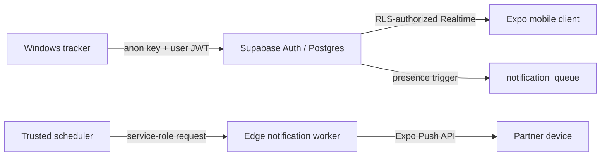

# Architecture

Game Presence Tracker is a security-first, event-driven monorepo. The Windows tracker is the presence writer, Supabase owns authorization and durable state, and the Expo app is a read-only partner experience.



## Boundaries

| Area | Owns | Must not own |
| --- | --- | --- |
| `desktop/` | Windows process detection, encrypted desktop session, presence writes | Service-role secrets or partner authorization |
| `mobile/src/features/auth` | Session observation and sign-in UI | Presence or notification persistence |
| `mobile/src/features/presence` | Linked-partner query, presence query, Realtime subscription, screen state | Authentication configuration |
| `mobile/src/features/notifications` | Permission and Expo-token registration | Notification delivery |
| `mobile/src/config` | Environment-derived Supabase client | Domain behavior |
| `sql/` | Schema, RLS, data invariants, outbox queue | Client-side trust decisions |
| `supabase/functions/` | Privileged queue processing and Expo delivery | Direct client invocation |

## Core invariants

- Clients use only the Supabase anon key and their own access token. The service-role key exists solely in Edge Function secrets and its trusted invoker.
- Partner links are written only by a trusted action. RLS lets an authenticated user read their own data and the one linked partner's data.
- Presence writes and notification enqueueing occur in the same database transaction through a trigger; notification work is claimed with `FOR UPDATE SKIP LOCKED`.
- The worker is idempotent in practice: workers claim rows atomically, records sent work, retries transient failures with backoff, and reclaims abandoned work after 15 minutes.
- The mobile client treats Realtime as a projection: it loads the current row first, then subscribes for changes, so reconnects never depend only on events.

## Client composition

The mobile app uses a feature-first structure rather than a screen-first structure:

```text
mobile/src/
  config/             # Infrastructure configuration
  features/
    auth/              # Session lifecycle and login
    notifications/     # Device registration
    presence/          # Partner domain, API, subscription, presentation
  shared/storage/      # Small cross-feature persistence adapters
```

Screens are feature presentation components. Data access lives in feature APIs, and orchestration/state lives in hooks. This keeps Supabase queries, AsyncStorage keys, and Expo APIs out of `App.tsx` and makes each domain independently testable.

## Operational flow

1. A desktop user signs in and detects a whitelisted process.
2. The desktop app upserts that user's `presence` and opens or closes a `game_sessions` row.
3. The presence trigger places a durable payload in `notification_queue`.
4. A trusted scheduler invokes `process-notifications`; it claims eligible rows and sends only to the linked partner's registered devices.
5. The mobile app fetches the authorized partner record and presence, then keeps its view fresh through Realtime.

## Change rules

- Make schema changes as ordered, idempotent SQL migrations; update RLS in the same change as every new table or access path.
- Generate Supabase database types before expanding the schema-facing TypeScript surface, then pass them to `createClient<Database>()`.
- Keep untrusted clients out of administrative partner-linking, queue-claiming, and notification-delivery paths.
- Add any new game detector behind the desktop whitelist and preserve the one-open-session-per-executable behavior.
