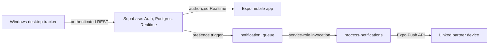

# Game Presence Tracker

Game Presence Tracker records games detected by a Windows tray application, stores presence and session history in Supabase, and lets a linked partner view live presence in an Expo mobile app. Presence changes are queued in PostgreSQL and delivered to registered Expo devices by a Supabase Edge Function.

The repository follows a feature-first mobile architecture and database-enforced trust boundaries. See [ARCHITECTURE.md](ARCHITECTURE.md) for ownership boundaries, invariants, and the end-to-end flow.



## Prerequisites

- .NET 8 SDK for the Windows desktop application.
- Node.js 20 or later and npm for the Expo app and Supabase CLI.
- A Supabase project with email/password authentication enabled.
- A physical Android/iOS device and an EAS project ID for Expo push notifications.

No client uses a Supabase service-role key. The desktop and mobile clients use only the public anon key plus the user’s Supabase access token.

## 1. Configure Supabase

In the Supabase SQL Editor, run these files in order:

1. [`sql/schema.sql`](sql/schema.sql)
2. [`sql/notification.sql`](sql/notification.sql)

Then enable Realtime for `presence` once:

```sql
alter publication supabase_realtime add table public.presence;
```

New Auth users automatically get a `profiles` row. Partner links are intentionally not client-editable: link two existing users through the SQL Editor or another trusted server action. For a mutual link:

```sql
update public.profiles set partner_id = '<SECOND-USER-UUID>' where id = '<FIRST-USER-UUID>';
update public.profiles set partner_id = '<FIRST-USER-UUID>' where id = '<SECOND-USER-UUID>';
```

RLS allows a user to read only their own data and the profile, presence, and sessions of the partner already linked to their profile. A user cannot submit an arbitrary UUID to create a link or bypass those policies.

## 2. Deploy notification processing

The function is in the Supabase CLI layout at [`supabase/functions/process-notifications`](supabase/functions/process-notifications/index.ts).

```powershell
npx supabase@latest login
npx supabase@latest link --project-ref YOUR_PROJECT_REF
npx supabase@latest secrets set SUPABASE_URL=https://YOUR_PROJECT_REF.supabase.co SUPABASE_SERVICE_ROLE_KEY=YOUR_SERVICE_ROLE_KEY
npx supabase@latest functions deploy process-notifications
```

Only a server-side scheduler or trusted process may invoke the function. It requires the `Authorization: Bearer <service-role-key>` header, claims queue rows atomically, retries transient failures up to five times with exponential backoff, and records permanent failures in `last_error`. It also recovers claims abandoned for more than 15 minutes and removes Expo tokens reported as unregistered.

For manual notification testing, set temporary PowerShell environment variables and run:

```powershell
$env:SUPABASE_URL = 'https://YOUR_PROJECT_REF.supabase.co'
$env:SUPABASE_SERVICE_ROLE_KEY = 'YOUR_SERVICE_ROLE_KEY'
./scripts/test_notification.ps1 -SupabaseUrl $env:SUPABASE_URL -ServiceRole $env:SUPABASE_SERVICE_ROLE_KEY -UserId 'SOURCE-USER-UUID'

Invoke-RestMethod -Method Post -Uri "$env:SUPABASE_URL/functions/v1/process-notifications" -Headers @{ Authorization = "Bearer $env:SUPABASE_SERVICE_ROLE_KEY" }
```

The test script inserts the queue shape used by the trigger: `{ "payload": { ... } }`.

## 3. Run the desktop tracker

Create `%APPDATA%\GamePresence\config.json` from [`desktop/config.example.json`](desktop/config.example.json). It contains only the Supabase URL and public anon key; do not add an email or password.

```powershell
cd desktop
dotnet restore GamePresence.Desktop.csproj
dotnet build GamePresence.Desktop.csproj -c Release
dotnet run --project GamePresence.Desktop.csproj
```

At first launch, sign in with email and password. The password is never persisted. Supabase access/refresh tokens are stored only in `%APPDATA%\GamePresence\token.bin`, encrypted with Windows DPAPI for the current Windows user. The app restores and refreshes that session on later launches.

When a whitelisted executable starts, the app writes authenticated presence and creates one `game_sessions` row. When it ends, it updates that same row with `end_time` and `duration`. The built-in executable list is in `desktop/ProcessMonitor.cs`.

## 4. Run the Expo app

```powershell
cd mobile
Copy-Item .env.example .env
# Edit .env with the public values from Supabase and your EAS project ID.
npm install
npm run typecheck
npm run doctor
npm run android
```

The app stores the authenticated Supabase session using React Native’s AsyncStorage; it never stores a password. After login, it registers the device’s Expo push token, loads the one partner linked to the account, and lets the user choose whether to monitor that linked partner. It then fetches and subscribes to the partner’s authorized `presence` row. Signing out clears the saved partner selection and Supabase session.

## Local configuration and secrets

- [`mobile/.env.example`](mobile/.env.example) and [`.env.example`](.env.example) contain placeholders only.
- `%APPDATA%\GamePresence\config.json` is local desktop configuration.
- `.env`, Expo build output, `node_modules`, .NET build output, editor workspaces, and credentials are ignored by Git.
- Keep `SUPABASE_SERVICE_ROLE_KEY` only in Supabase Function secrets or a protected shell/session used for server-side invocation. Never put it in desktop or mobile configuration.

## Validation checklist

```powershell
# Desktop
dotnet --info
cd desktop; dotnet restore; dotnet build -c Release

# Mobile
cd mobile; npm install; npm run typecheck; npm run doctor

# Or, from the repository root after bootstrap
npm run check
npm run mobile:doctor

# Repository
git status
```

Actual desktop/mobile end-to-end validation still requires your Supabase project values, two linked Auth users, and a physical mobile device. The SQL and Edge Function should be applied/deployed before attempting that flow.
